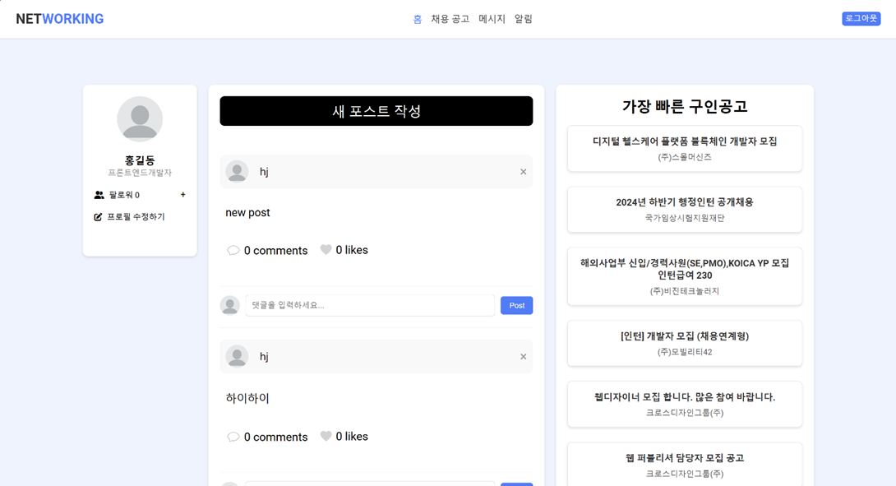
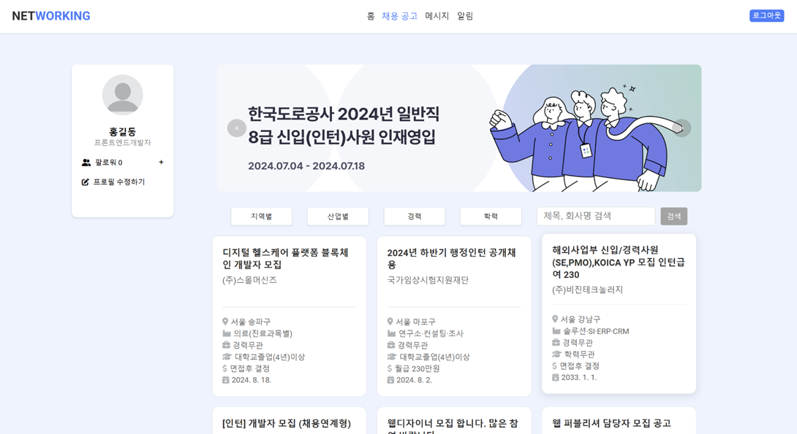

# netWORKING

## IT 구직자 소통 및 정보 교류 플랫폼

    
    
    
    

## 개발 목적
IT 분야 구직자와 기업이 서로 소통하고 정보를 공유할 수 있는 커뮤니티 서비스를 제공하여 사용자의 커리어 발전에 도움을 줍니다.

## 사용 기술

<table>
  <tr>
    <td>언어</td>
    <td>Javascript, Java, HTML, CSS</td>
  </tr>
  <tr>
    <td>서버</td>
    <td>Apache Tomcat 10</td>
  </tr>
  <tr>
    <td>프레임워크</td>
    <td>React, Spring Boot</td>
  </tr>
  <tr>
    <td>DB</td>
    <td>MySQL</td>
  </tr>
  <tr>
    <td>IDE</td>
    <td>Visual Studio Code</td>
  </tr>
  <tr>
    <td>API</td>
    <td>Saramin api(채용 데이터 연동)</td>
  </tr>
  <tr>
    <td>배포</td>
    <td>NCP Server, Putty, Jenkins</td>
  </tr>
</table>
